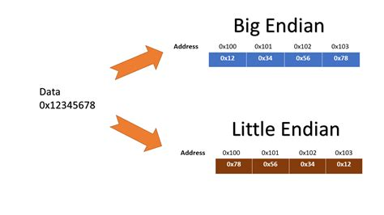

## **Tutorials**
### **How a CPU works and Introduction to Assembler**
- [How a CPU works and Introduction to Assembler - bin 0x04](https://www.youtube.com/watch?v=6jSKldt7Eqs&list=PLhixgUqwRTjxglIswKp9mpkfPNfHkzyeN&index=7)

## **Knowledge Base**

### Big- und Little Endian
)

### **MSP430**
- https://phas.ubc.ca/~michal/phys319/MSP430Reference-RyansEdit.pdf 
